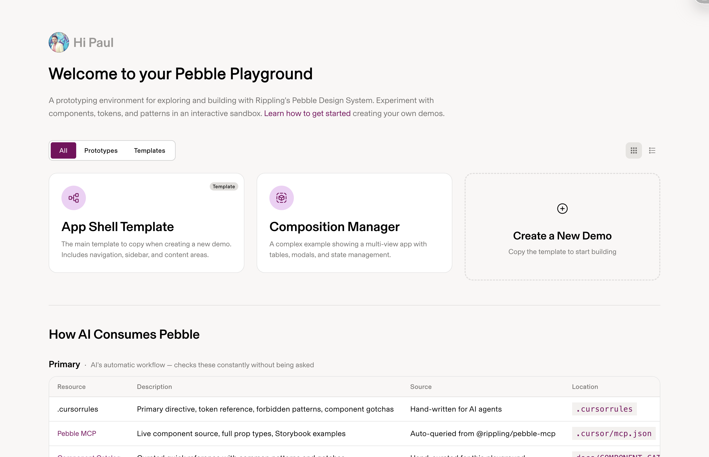

# Pebble Playground

**Your personal sandbox for prototyping with AI and Rippling's design system.**

Think of this as your private workspace where you can describe what you want to build, and AI (like Cursor) makes it real—using actual Pebble components, not generic placeholders.

---

## What This Is

A workspace for prototyping with AI using Rippling's actual design system. When you build here, AI uses real Pebble components instead of generic alternatives—so your prototypes match production from the start.

Build interactive mockups (modals, forms, dashboards), test micro-interactions, or explore layout ideas. Since everything uses Pebble's actual components and design tokens, what you build can be handed off to engineering without translation.



---

## Getting Started

### 1. Fork this repo (don't clone!)

**Why fork?** Each person/team gets their own copy to customize, deploy to Vercel, and maintain independently—while still being able to pull updates from the core repo. Previous approaches of sharing one repo led to conflicts, bloat, and dependency nightmares.

**To fork:**

1. Go to [github.com/pbest/pebble-playground](https://github.com/pbest/pebble-playground)
2. Click the **"Fork"** button (top right)
3. Choose your personal account or your team's org
4. Clone **your fork** locally:

```bash
git clone https://github.com/YOUR-USERNAME/pebble-playground.git
cd pebble-playground
```

**Set up upstream to get future updates:**

```bash
git remote add upstream https://github.com/pbest/pebble-playground.git
```

Now you can pull improvements from the core repo anytime:

```bash
git fetch upstream
git merge upstream/main
# Resolve any conflicts, then commit
```

> 💡 **Tip:** Your fork is yours—add demos, customize themes, break things. When we release new features or fixes, just pull from upstream to get them.

### 2. Install and run

```bash
yarn install
yarn dev
```

The playground opens at **http://localhost:4201** with a personalized greeting.

> **Note:** Running `yarn install` automatically sets up the **Pebble MCP** (Model Context Protocol) server. This gives AI assistants like Cursor direct access to Pebble component documentation, props, and examples. Just restart Cursor after install to activate it!

### 3. Start building

Open the `pebble-playground` folder in Cursor (File → Open Folder → select the folder you just cloned). Then start chatting with AI. Try this:

> *"Create a new demo called 'Employee Directory' by copying app-shell-template.tsx. Show a list of employees with avatars, names, and job titles. Use Pebble components."*

AI creates the file, wires it up, and you'll see it live at the URL.

> 💡 **Where are my demos?** Your demo files live in `src/demos/`. That's where AI creates new demos and where you'll find examples to learn from.

**Need help?** See the detailed [Setup Guide](./SETUP_GUIDE.md) for troubleshooting.

---

## 🚀 Deploy Your Fork to Vercel

Want to share your demos online? Deploy your fork to Vercel (free, takes 2 minutes):

1. **Go to [vercel.com](https://vercel.com)** → sign in or create a free account
2. **Click "Add New" → "Project"**
3. **Import your fork** from GitHub (not the original pbest/pebble-playground)
4. **Deploy** → Vercel builds and deploys automatically
5. **Your playground is live** at `https://your-fork-name.vercel.app`

Once deployed, Vercel auto-rebuilds whenever you push to your fork. Your demos, your deployments, your URL—no conflicts with anyone else!

---

## How to Use With AI (Cursor)

This playground is designed to work seamlessly with AI coding assistants like Cursor. Here's the pattern:

### Your Workflow

1. **Describe what you want** in natural language
   - "Add a modal with a confirmation button"
   - "Make the sidebar collapsible with an icon"
   - "Use our primary color for the header background"

2. **AI builds it** using real Pebble components
   - It checks the built-in docs for component APIs
   - Uses proper design tokens (colors, spacing, typography)
   - Follows Rippling's patterns and best practices

3. **See it live instantly** - no compile step, just refresh
   - Make changes: "Move that to the right side"
   - Iterate: "Make it bigger"
   - Refine: "Use our secondary button style"

### Tips for Better Results

✅ **Be specific:** "Create a card with rounded corners" → "Create a Card using Pebble's Card.Layout component"

✅ **Reference examples:** "Make it look like the getting-started page"

✅ **Ask questions:** "What Pebble components should I use for a settings form?"

❌ **Don't worry about code** - just describe what you want to see

---

## What's Inside

### 📁 Your Demos (`src/demos/`)

This is where your prototypes live:

- **`app-shell-template.tsx`** - The main template to copy for new demos (includes nav, sidebar, content area)
- **Other demos** - Working examples showing different Pebble patterns

**Quickest way to create a new demo:**

Ask Cursor: *"Create a new demo called 'Employee Directory' by copying app-shell-template.tsx"*

Or start from scratch: *"Create a simple demo showing a card with user info"*

### 🪨 Pebble MCP (AI Superpower)

The **Pebble MCP** (Model Context Protocol) server is automatically configured when you run `yarn install`. This gives AI assistants direct access to:

- **Live component source code** - Actual prop types and implementations
- **Storybook examples** - Working code examples for every component
- **Full component list** - Discover all available Pebble components

**Check your MCP status:**
```bash
yarn mcp:status
```

**Troubleshooting:** If Cursor doesn't seem to know about Pebble components, restart Cursor after running `yarn install`. The MCP server starts automatically when Cursor opens the project.

### 📖 Built-in Docs (`docs/`)

AI automatically references these docs when building your prototypes:

- **Component Catalog** - Quick reference for all Pebble components
- **Token Catalog** - Colors, spacing, typography
- **Component Guides** - When to use each component and why
- **Pattern Library** - Common UI patterns (modals, forms, tables, etc.)
- **Import Patterns** - How to import shared utilities and assets

You don't need to read these—AI does it for you. But they're there if you want to learn!

**Pro tip:** Always use `@/` imports for shared resources (e.g., `@/utils/theme`, `@/assets/logo.svg`) so your demos work from any folder. See [docs/IMPORT_PATTERNS.md](./docs/IMPORT_PATTERNS.md) for details.

### 🎨 Live Examples

The playground includes working examples:
- **App Shell Template** - Full Rippling app layout (nav, sidebar, content) - copy this to start new demos
- **Composition Manager** - Complex multi-view app with tables, modals, and state management
- **Getting Started** - This guide, but prettier

Click around to see what's possible!

---

## Working With a Teammate

Since you forked the repo, you have full control over who can collaborate:

**Option A: Add collaborators to your fork**
1. Go to your fork's Settings → Collaborators
2. Click **"Add people"** → enter their GitHub username
3. Give them **Write** access

**Option B: Each person forks their own copy**
- Best for independent experimentation
- Share ideas via PRs to a shared team fork, or just share links

Once collaborating, you can both:
- Create branches for different ideas
- Review each other's prototypes
- Share demos by committing and pushing

**Pro tip:** Each person sees a personalized greeting on the homepage (e.g., "Hi Paul" vs "Hi Sarah") since the setup auto-detects from your git config.

---

## Common Questions

### "I'm not an engineer—will this be hard?"

Not at all! You're not writing code—you're describing what you want in plain English. AI handles the technical details. Think of it like working with a really fast, really patient engineer who never sleeps.

### "What if I break something?"

You won't! This is your personal playground. Worst case, just delete the file and start over. That's what it's here for—safe experimentation.

### "Can I share my prototypes?"

Yes! Just push your changes to GitHub and share the branch link with your teammate. Or, run `yarn dev` and share screenshots/recordings of the live prototype.

### "Do I need to learn React?"

Nope! You'll pick up patterns naturally by working with AI. Over time you'll recognize component names and props, but that's learning by doing—not required upfront.

### "What if AI uses the wrong component?"

Just tell it! Say "Use a Button instead of a link" or "That should be an Input.Text, not a textarea." AI will correct it instantly. The built-in docs help AI make better choices, but you're always in control.

---

## Need Help?

- **Detailed setup:** [SETUP_GUIDE.md](./SETUP_GUIDE.md)
- **Technical questions:** Check the [docs/](./docs/) folder
- **AI tips:** [docs/AI_PROMPTING_GUIDE.md](./docs/AI_PROMPTING_GUIDE.md)
- **Got stuck?** Ask your teammate or #design-systems

---

## Why Use This vs Other Tools

Generic AI prototyping tools (v0, shadcn) use placeholder components that don't match Rippling's design system. This playground uses Pebble directly, so prototypes look and behave like production from the start. No translation needed when handing off to engineering.

---

## Ready to Build?

```bash
yarn dev
```

Open **http://localhost:4201** and start chatting with AI in Cursor. 

Try this first prompt: *"Create a new demo showing a simple employee profile card with an avatar, name, title, and edit button. Use Pebble components."*
